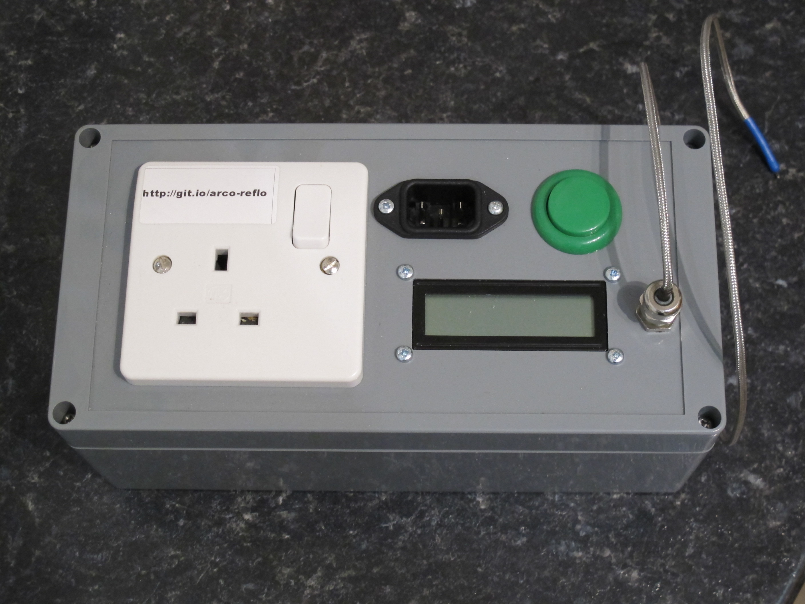
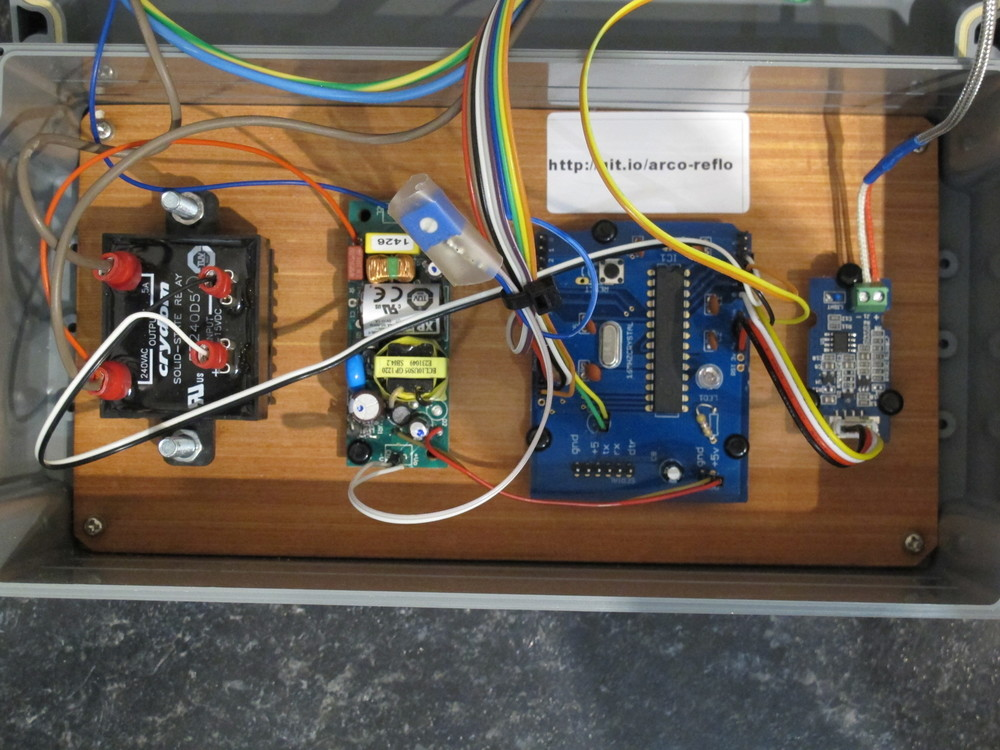
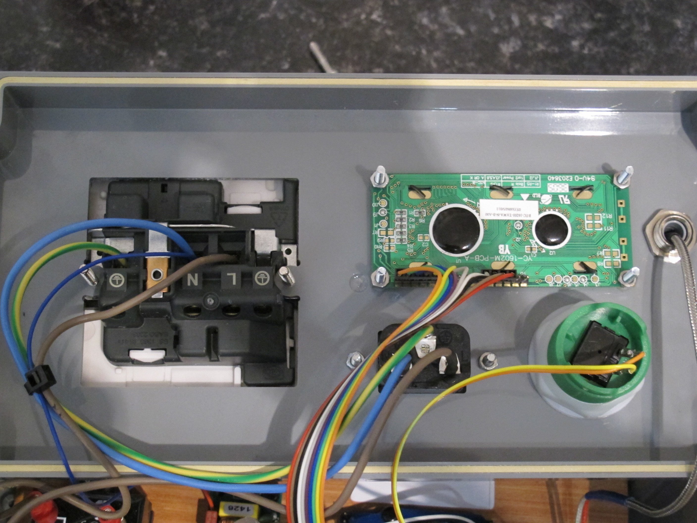

# Arcola Energy reflow toaster oven

## Use

* Plug in oven and mains. Ensure oven is no more than 900W
* Ensure temperature sensor is attached to a place near the boards
* Press big green button

## Firmware

Adapted from work by [Adrian Bowyer](http://reprap.org/wiki/Toaster_Oven_Reflow_Technique#Firmware). 
Microcontroller is Atmel mega328 with Arduino Uno bootloader.

## Solder paste

From farnell, part 149968

## BOM

* [temperature sensor and amplifier](http://www.seeedstudio.com/wiki/Grove_-_High_Temperature_Sensor)

Following are all from farnell:

* solid state relay rated at 5A: 120028
* box 1526657
* 5V, 1A PSU 1765275
* IEC inlet 313737
* mains socket 987190

## Internal Pictures

from left: SSR, PSU, arduino clone (shrimp) and temperature sensor amplifier

from left: mains plug, lcd, IEC inlet, button and temperature sensor 

