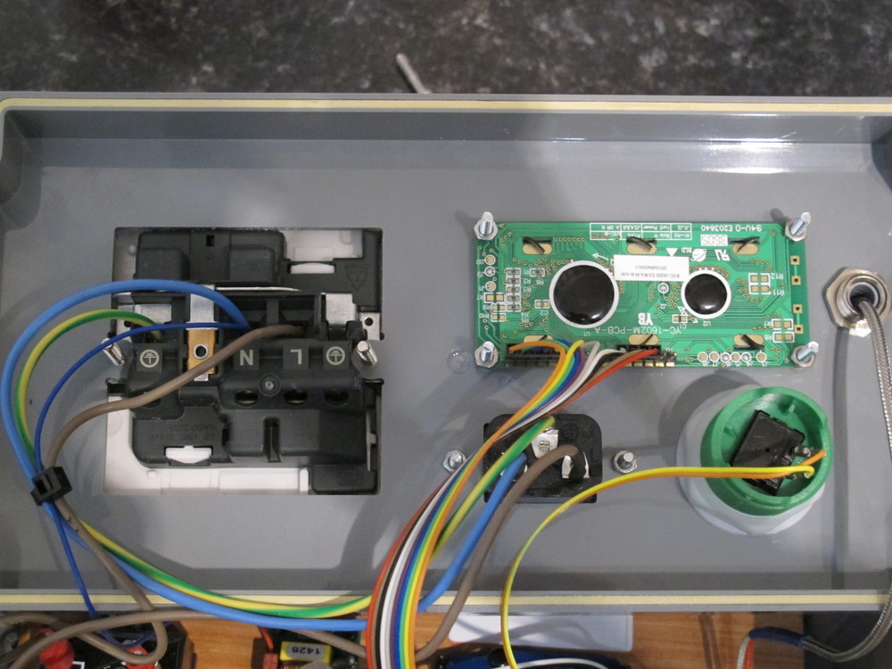

# Arcola Energy reflow toaster oven

## Use

### Software setup on Arlan's mac

Followed [these instructions](http://www.idleloop.com/robotics/cutter/)

* installed cream-dxf.ulp, and exported eagle board file top cream to dxf
* change silhouette settings to leave dxf instead of scale to fit

### Cutting

* blade settingon silhouette was #2
* open the dxf in silhouette and cut the vinyl 
* 70 micron vinyl was [ordered](http://www.ebay.co.uk/itm/191422915226) from
[thevinylwarehouse](http://www.ebay.co.uk/usr/thevinylwarehouse) from ebay

### Apply solder paste

* Paste from farnell part 149968
* Align sticker carefully! Can be moved if necessary
* Use small amount of paste
* Use a credit card to squeeze paste through holes, drag don't push

### Place components

* Place components, accuracy is good but the process is tolerant to slight
 placement errors

### Cooking!

* Plug in oven and mains. Ensure oven is no more than 900W
* Ensure temperature sensor is attached to a place near the boards
* Press big green button

## Inside the box

### Firmware

[Firmware](firmware/reflow/reflow.ino) adapted from work by [Adrian Bowyer](http://reprap.org/wiki/Toaster_Oven_Reflow_Technique#Firmware). 

Microcontroller is Atmel mega328 with Arduino Uno bootloader.

### CAD

[CAD files](cad) for the base plate and lid.

### BOM

* [temperature sensor and amplifier](http://www.seeedstudio.com/wiki/Grove_-_High_Temperature_Sensor)

Following are all from farnell:

* solid state relay rated at 5A: 120028
* box 1526657
* 5V, 1A PSU 1765275
* IEC inlet 313737
* mains socket 987190

### Internal Pictures

from left: SSR, PSU, arduino clone (shrimp) and temperature sensor amplifier

from left: mains plug, lcd, IEC inlet, button and temperature sensor 

